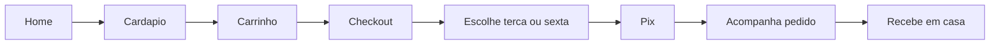
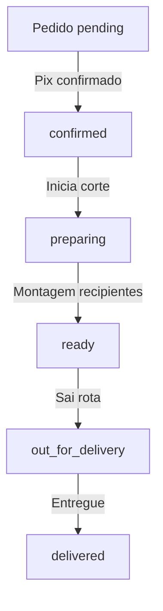

# 05 — Fluxos e Jornadas

## Jornada do cliente



### Passo a passo

1. **Descoberta** — Home explica proposta (cortado no dia, 2x/semana).
2. **Escolha** — Cardapio: combos em destaque + avulsos.
3. **Carrinho** — Adiciona quantidades.
4. **Checkout** — Dados + endereco + **janela de entrega**.
5. **Pagamento** — Pix (QR/copia e cola).
6. **Confirmacao** — Pagina do pedido com timeline.
7. **Entrega** — Terca ou sexta conforme escolha.

---

## Jornada operacional (Pomar Fresh)



### Rotina sugerida

#### Segunda / Quinta (véspera)
- Fechar pedidos no cutoff 18h.
- Listar pedidos confirmados por combo/produto.
- Separar estoque bruto para corte no dia seguinte.

#### Terca / Sexta (dia D)
- Manha: corte e montagem (status `preparing`).
- Meio-dia: recipientes prontos (`ready`).
- Tarde: rotas de entrega (`out_for_delivery` → `delivered`).

---

## Jornada admin

1. Login em `http://localhost:3021`.
2. **Dashboard** — volume do dia/semana.
3. **Pedidos** — fila ativa, avancar status.
4. **Produtos / Combos** — consultar catalogo.
5. **Estoque** — alertas + movimentacoes.

---

## Fluxo de estoque

```
Compra fornecedor → entrada (stock in)
       ↓
Pedido confirmado (produto avulso) → saida (stock out)
       ↓
Ajuste inventario → adjustment
       ↓
stockQty <= minStock → alerta admin
```

---

## Fluxo de pagamento

```
POST /orders → status pending
       ↓
POST /payments/pix → aguardando
       ↓
Webhook ou simulate → confirmed
       ↓
Baixa estoque + historico status
```

---

## Casos de excecao

| Situacao | Acao |
|----------|------|
| Pix nao pago em 24h | Cancelar pedido (P2 automatico) |
| Estoque insuficiente | Bloquear item no checkout |
| Cliente fora area | Bloquear CEP (P2) |
| Feriado | Desativar janela (P2) |
